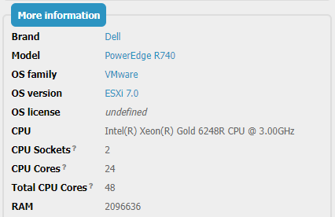

# iTop-br-cpu-extension

Copyright (c) 2022-2024 Björn Rudner

## What?

Save information on sockets and cores of physical CPUs.

This information can be useful for reporting licensing information.

You can synchronize this information by customizing the [vSphere data collector](https://github.com/Combodo/itop-data-collector-vsphere).

## How?

### Screenshot

### Class: Server

Add the following fields:

* CPU Sockets - Number of physical sockets / Number of CPUs in this Server
* CPU Cores - Number of Cores per CPU
* CPU Count (calculated) - Number of total Cores in this Server (Sockets * Cores)

## iTop Compatibility

The branch [2.7](https://github.com/rudnerbjoern/iTop-br-cpu-extension/tree/itop/2.7) is compatible to iTop 2.7 and iTop 3.1.

The branch [main](https://github.com/rudnerbjoern/iTop-br-cpu-extension/tree/main) will only be compatible to iTop 3.1.

Versions starting with 2.7.x are kept compatible to iTop 2.7

The extension was tested on iTop 2.7.10 and 3.1.1
