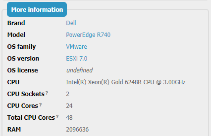

# iTop-br-cpu-extension

Copyright (c) 2023-2026 Björn Rudner

## Overview

This extension adds structured CPU information to the **Server** class in iTop.

It allows storing:

- the number of physical CPU sockets
- the number of cores per CPU
- a calculated total CPU core count

The calculated value is derived automatically and is read-only.

This information is especially useful for:

- license compliance and reporting
- capacity planning
- infrastructure documentation

## Features

- Extends the **Server** class
- Adds structured CPU attributes
- Automatically computes total CPU cores
- Uses `EVENT_DB_COMPUTE_VALUES` for clean derived-field handling
- `cpu_count` is read-only and cannot be edited manually
- Compatible with data collectors (e.g. vSphere)

## Fields Added to Class: Server

| Field           | Description                                                             |
| --------------- | ----------------------------------------------------------------------- |
| **CPU Sockets** | Number of physical CPU sockets in the server                            |
| **CPU Cores**   | Number of cores per physical CPU                                        |
| **CPU Count**   | Total number of CPU cores (`sockets × cores`), calculated automatically |

`cpu_count` is stored as a string by design to allow future formatting (e.g. `2×12 (24)` or `n/a`).

## How It Works

- `cpu_count` is defined as a derived attribute
- Dependencies are declared on `cpu_sockets` and `cpu_cores`
- The value is calculated using `EVENT_DB_COMPUTE_VALUES`
- The attribute is enforced as read-only using attribute flags
- If required values are missing or invalid, `cpu_count` is set to `NULL`

## Screenshot

## Integration with Data Collectors

The CPU socket and core information can be synchronized automatically by extending the
[vSphere Data Collector](https://github.com/Combodo/itop-data-collector-vsphere).

## iTop Compatibility

| Branch     | Compatible iTop Versions |
| ---------- | ------------------------ |
| `itop/2.7` | iTop 2.7, iTop 3.1       |
| `main`     | iTop 3.2 only            |

Versions starting with `2.7.x` are kept compatible with iTop 2.7.

## Tested Versions

- iTop 2.7.10
- iTop 3.2.2

## Translations

Special thanks to [Konstantin Nikulin](https://github.com/apollo2k4) for providing the Russian translation.